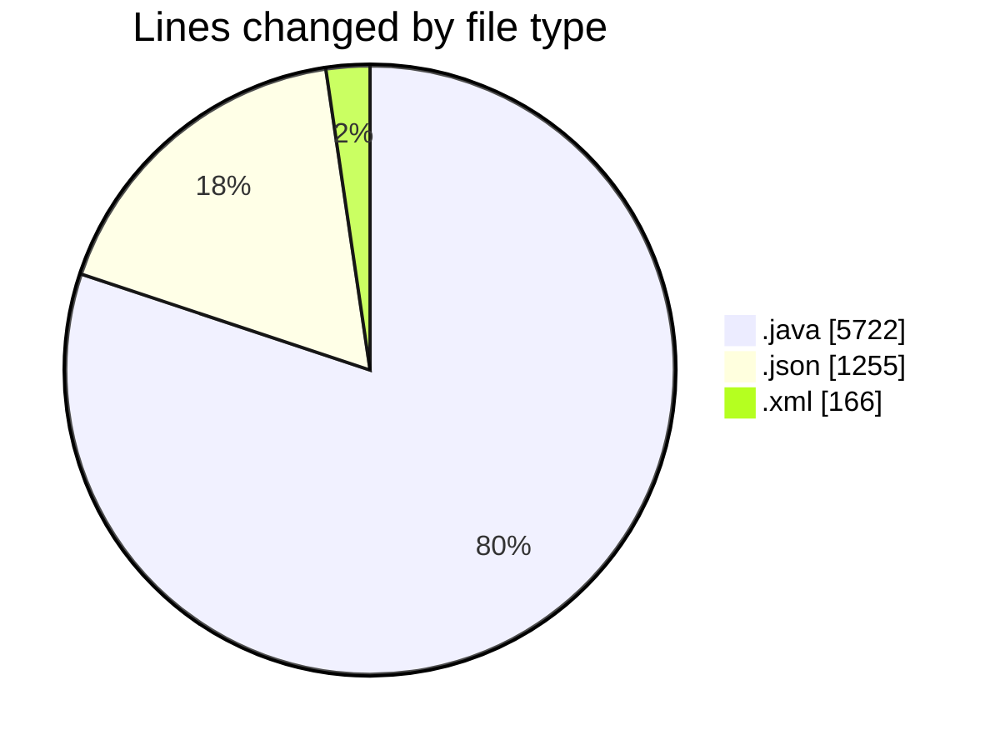
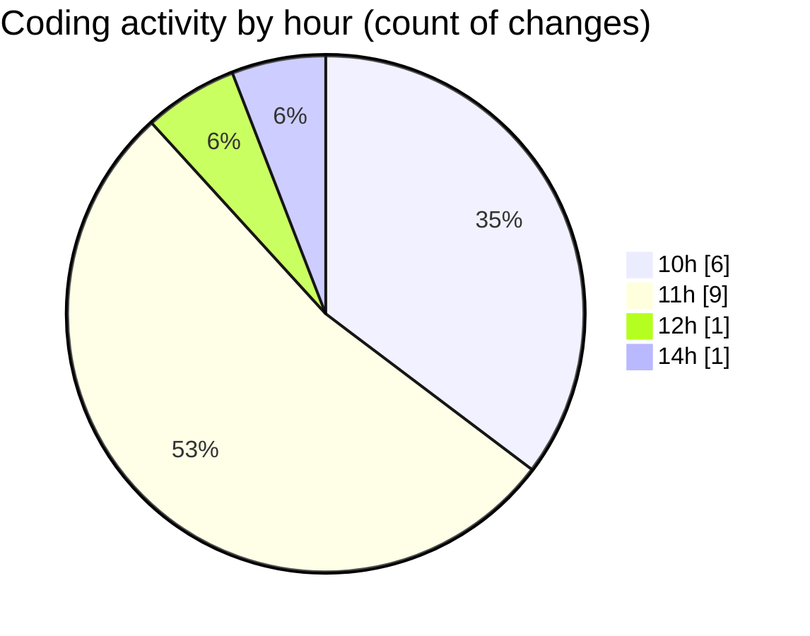

# CILApp - Activity Summary 

## Overall Statistics

| Stat                   | Value                                                             |
| ---------------------- | ----------------------------------------------------------------- |
| **Lines Added** (➕)   | 7136                                          |
| **Lines Removed** (➖) | 7                                        |
| **Net Change** (↕)    | 7129                |
| **Active Time** (⌚)   | 21 minutes |

## Modified Files
- **OfertasComerciales.java** (+2083, -7)
- **leerzip.java** (+1, -0)
- **XlsxRangeValidator.java** (+397, -0)
- **launch.json** (+1255, -0)
- **pom.xml** (+166, -0)
- **PanelGestionRecobro.java** (+3234, -0)

## Visualizations

### By File Type (Lines Changed)

### By Hour (Estimated Activity Count)

> **Last Updated:** 7/8/2026, 2:08:18 PM