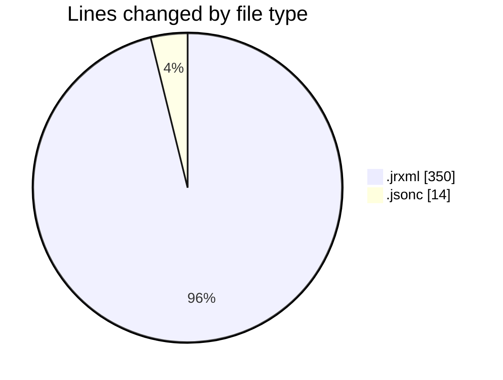
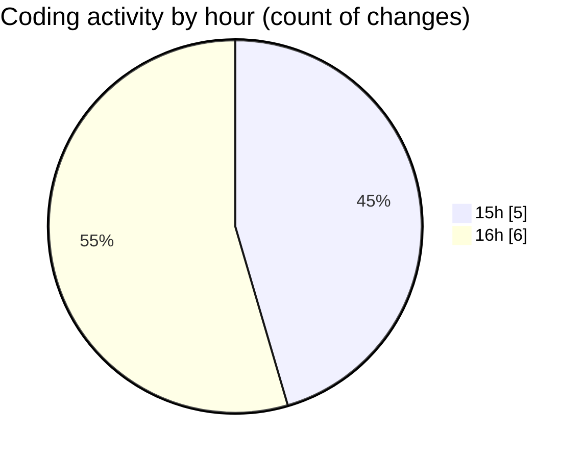

# CILReports (Workspace) - Activity Summary 

## Overall Statistics

| Stat                   | Value                                                             |
| ---------------------- | ----------------------------------------------------------------- |
| **Lines Added** (➕)   | 308                                          |
| **Lines Removed** (➖) | 56                                        |
| **Net Change** (↕)    | 252                |
| **Active Time** (⌚)   | 7 minutes |

## Modified Files
- **DEMANDA_BASE.jrxml** (+294, -56)
- **opencode.jsonc** (+14, -0)

## Visualizations

### By File Type (Lines Changed)

### By Hour (Estimated Activity Count)

> **Last Updated:** 7/9/2026, 4:37:57 PM