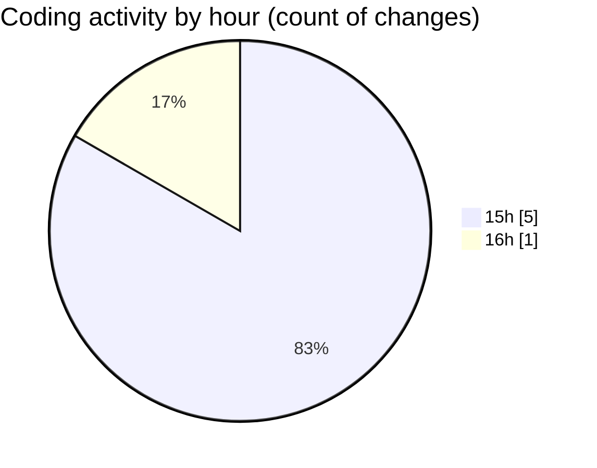

# CILReports (Workspace) - Activity Summary 

## Overall Statistics

| Stat                   | Value                                                             |
| ---------------------- | ----------------------------------------------------------------- |
| **Lines Added** (➕)   | 256                                          |
| **Lines Removed** (➖) | 19                                        |
| **Net Change** (↕)    | 237                |
| **Active Time** (⌚)   | 0 minute |

## Modified Files
- **DEMANDA_BASE.jrxml** (+242, -19)
- **opencode.jsonc** (+14, -0)

## Visualizations

### By File Type (Lines Changed)

### By Hour (Estimated Activity Count)

> **Last Updated:** 7/9/2026, 4:12:57 PM