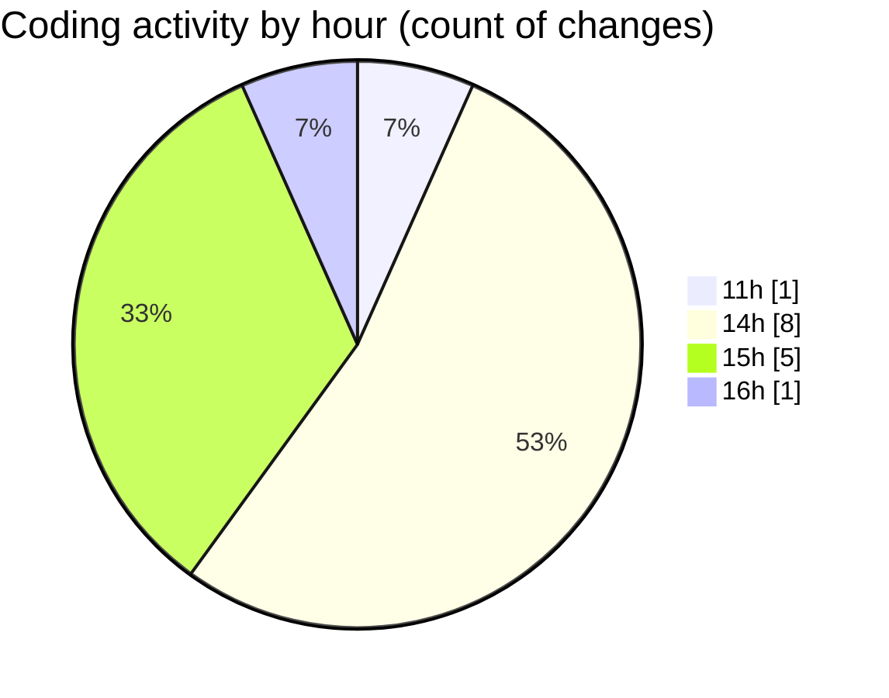

# CILReports (Workspace) - Activity Summary 

## Overall Statistics

| Stat                   | Value                                                             |
| ---------------------- | ----------------------------------------------------------------- |
| **Lines Added** (➕)   | 1833                                          |
| **Lines Removed** (➖) | 1                                        |
| **Net Change** (↕)    | 1832                |
| **Active Time** (⌚)   | 19 minutes |

## Modified Files
- **IF2DistributionRepository.java** (+415, -0)
- **DistributionDocumentationServiceImpl.java** (+1100, -1)
- **JasperFunctionsUtil.java** (+194, -0)
- **ConstantsJasperIF2Documentation.java** (+104, -0)
- **ObjectResponseDistribution.java** (+20, -0)

## Visualizations

### By File Type (Lines Changed)

### By Hour (Estimated Activity Count)

> **Last Updated:** 7/21/2026, 4:01:14 PM