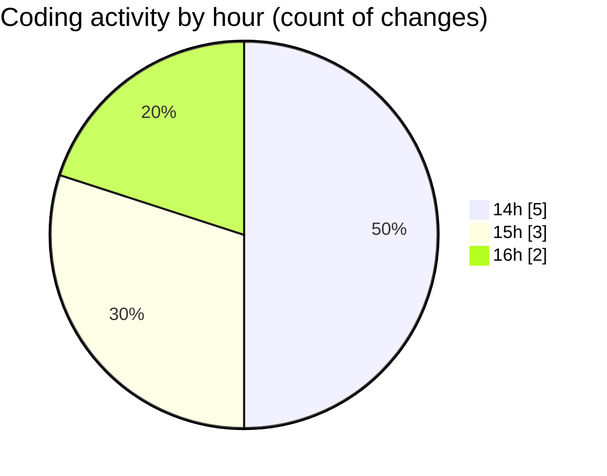

# CILReports (Workspace) - Activity Summary 

## Overall Statistics

| Stat                   | Value                                                             |
| ---------------------- | ----------------------------------------------------------------- |
| **Lines Added** (➕)   | 901                                          |
| **Lines Removed** (➖) | 68                                        |
| **Net Change** (↕)    | 833                |
| **Active Time** (⌚)   | 3 minutes |

## Modified Files
- **JasperCobrosUtil.java** (+263, -0)
- **JasperCobrosRepository.java** (+0, -14)
- **JasperAsesoriaServiceImp.java** (+316, -0)
- **JUDICIAL_ESCRITO_V1.jrxml** (+322, -54)

## Visualizations

### By File Type (Lines Changed)

### By Hour (Estimated Activity Count)

> **Last Updated:** 8/27/2026, 4:06:49 PM