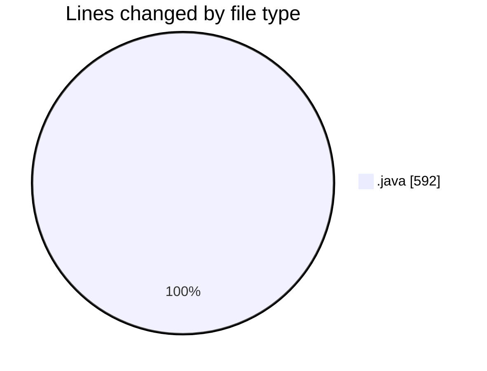
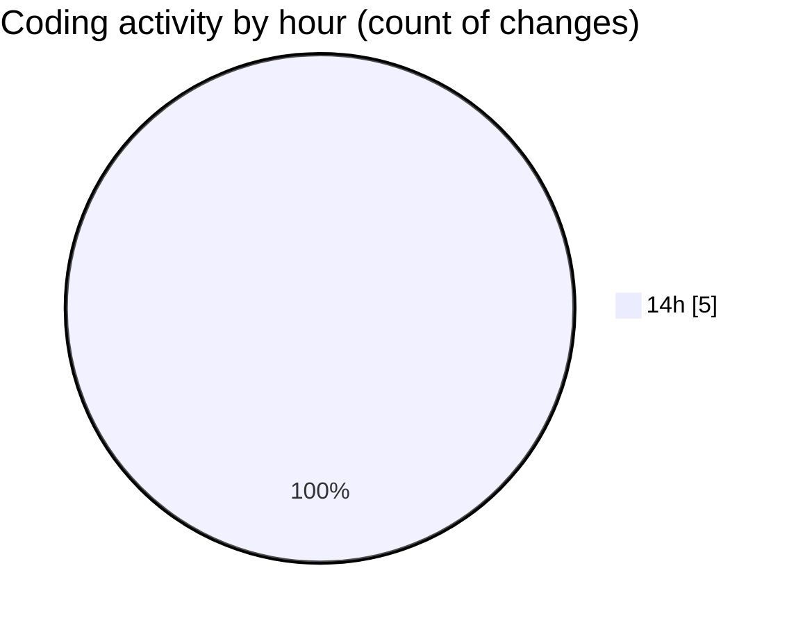

# CILReports (Workspace) - Activity Summary 

## Overall Statistics

| Stat                   | Value                                                             |
| ---------------------- | ----------------------------------------------------------------- |
| **Lines Added** (➕)   | 578                                          |
| **Lines Removed** (➖) | 14                                        |
| **Net Change** (↕)    | 564                |
| **Active Time** (⌚)   | 2 minutes |

## Modified Files
- **JasperCobrosUtil.java** (+263, -0)
- **JasperCobrosRepository.java** (+0, -14)
- **JasperAsesoriaServiceImp.java** (+315, -0)

## Visualizations

### By File Type (Lines Changed)

### By Hour (Estimated Activity Count)

> **Last Updated:** 8/27/2026, 2:51:47 PM