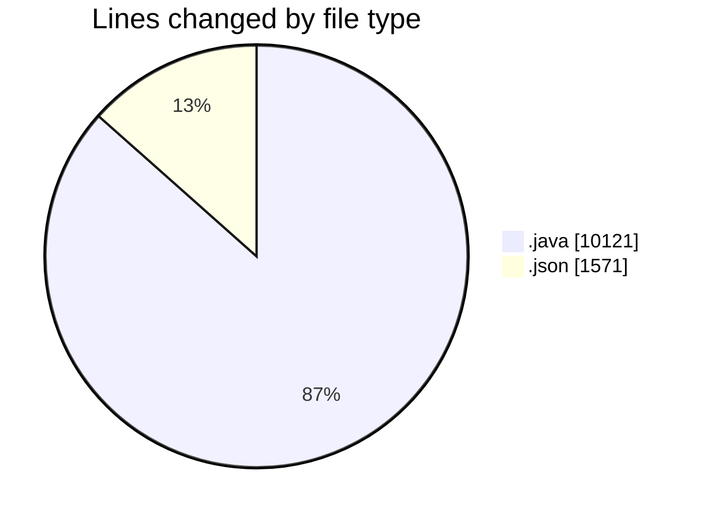
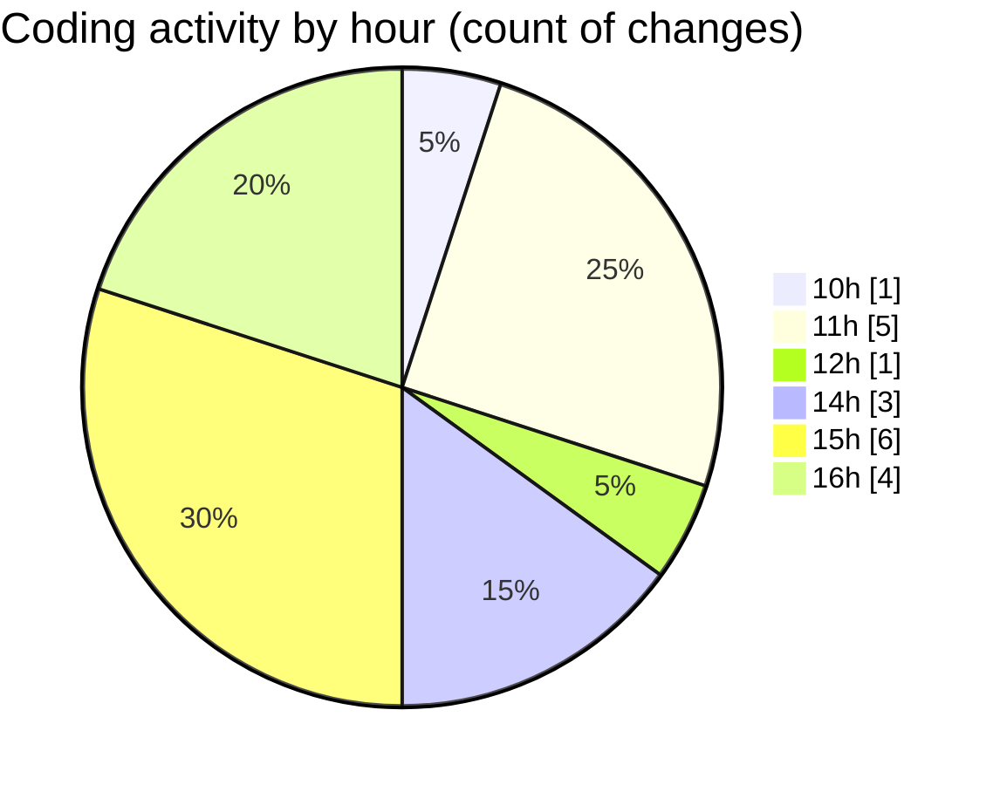

# CILApp - Activity Summary 

## Overall Statistics

| Stat                   | Value                                                             |
| ---------------------- | ----------------------------------------------------------------- |
| **Lines Added** (➕)   | 11516                                          |
| **Lines Removed** (➖) | 176                                        |
| **Net Change** (↕)    | 11340                |
| **Active Time** (⌚)   | 23 minutes |

## Modified Files
- **PresentacionMonitorios.java** (+7495, -155)
- **settings.json** (+255, -19)
- **XmlToPdfServiceImpl.java** (+621, -2)
- **ProcMonitorioToMASC.java** (+826, -0)
- **launch.json** (+1297, -0)
- **MascSmsService.java** (+1022, -0)

## Visualizations

### By File Type (Lines Changed)

### By Hour (Estimated Activity Count)

> **Last Updated:** 9/3/2026, 4:21:52 PM