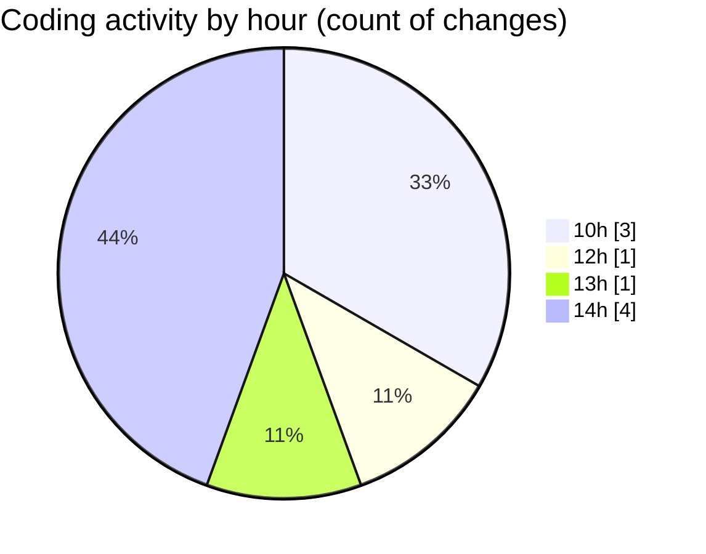

# CILReports (Workspace) - Activity Summary 

## Overall Statistics

| Stat                   | Value                                                             |
| ---------------------- | ----------------------------------------------------------------- |
| **Lines Added** (➕)   | 722                                          |
| **Lines Removed** (➖) | 3                                        |
| **Net Change** (↕)    | 719                |
| **Active Time** (⌚)   | 6 minutes |

## Modified Files
- **QuillToJasperHtmlConverter.java** (+326, -3)
- **settings.json** (+11, -0)
- **JUDICIAL_ESCRITO_V1.jrxml** (+282, -0)
- **QuillJasperBodyNormalizer.java** (+103, -0)

## Visualizations

### By File Type (Lines Changed)

### By Hour (Estimated Activity Count)

> **Last Updated:** 9/16/2026, 2:54:13 PM