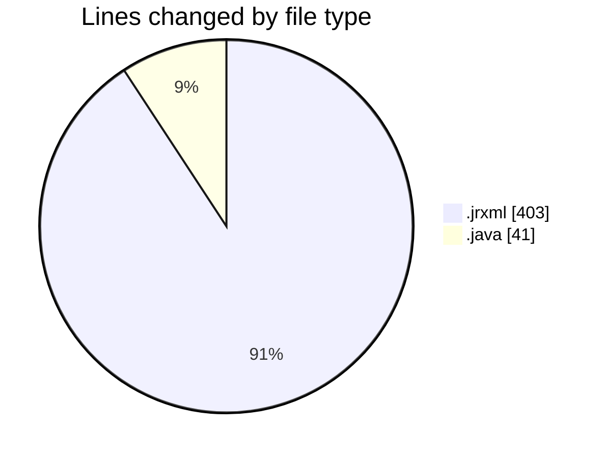
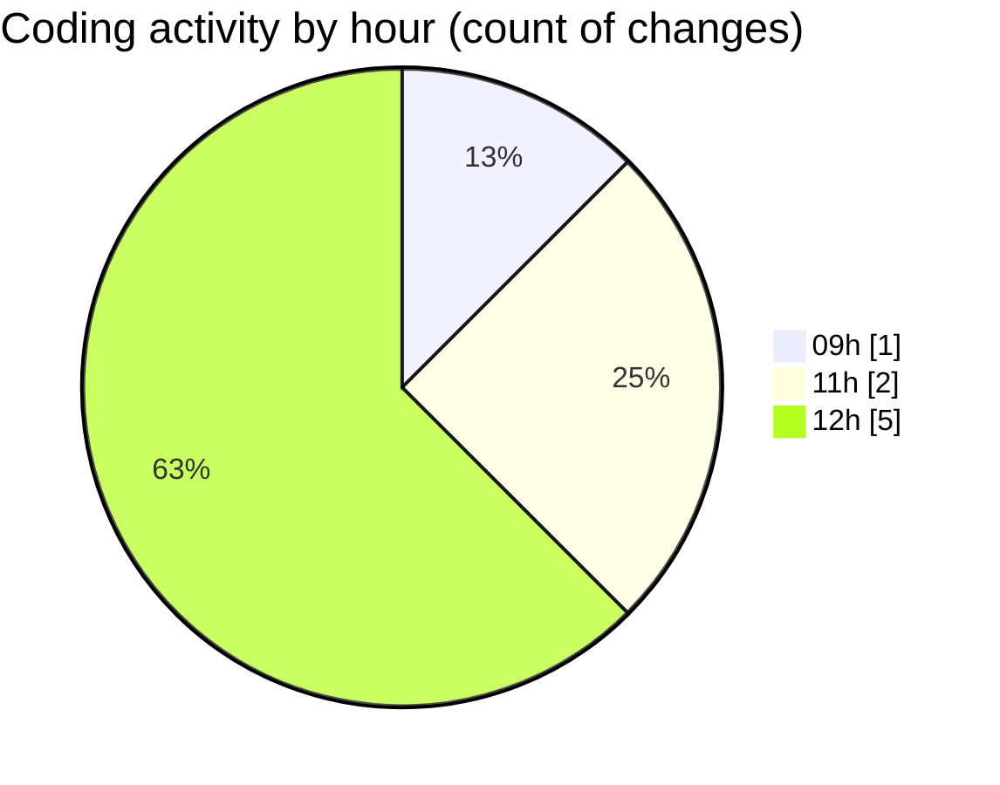

# CILReports (Workspace) - Activity Summary 

## Overall Statistics

| Stat                   | Value                                                             |
| ---------------------- | ----------------------------------------------------------------- |
| **Lines Added** (➕)   | 356                                          |
| **Lines Removed** (➖) | 88                                        |
| **Net Change** (↕)    | 268                |
| **Active Time** (⌚)   | 3 minutes |

## Modified Files
- **JUDICIAL_ESCRITO_V1.jrxml** (+282, -69)
- **SUBREPORTE_CABECERA.jrxml** (+52, -0)
- **QuillJasperBodyNormalizer.java** (+22, -19)

## Visualizations

### By File Type (Lines Changed)

### By Hour (Estimated Activity Count)

> **Last Updated:** 9/17/2026, 12:15:58 PM