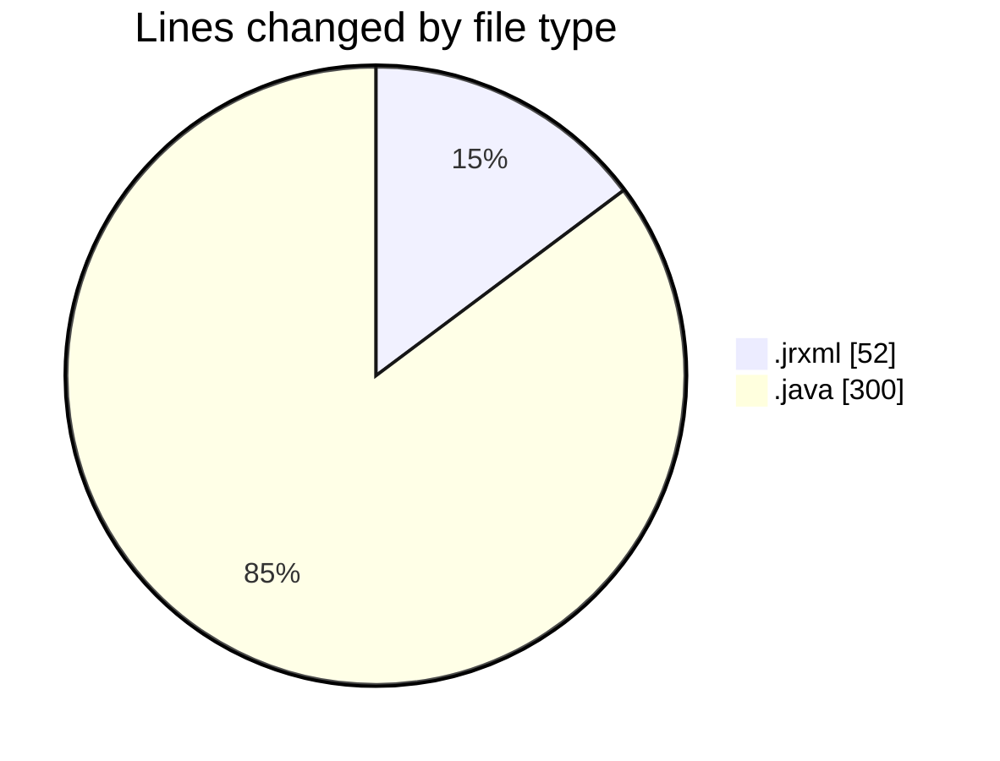

# CILReports (Workspace) - Activity Summary 

## Overall Statistics

| Stat                   | Value                                                             |
| ---------------------- | ----------------------------------------------------------------- |
| **Lines Added** (➕)   | 352                                          |
| **Lines Removed** (➖) | 0                                        |
| **Net Change** (↕)    | 352                |
| **Active Time** (⌚)   | 2 minutes |

## Modified Files
- **SUBREPORTE_CABECERA.jrxml** (+52, -0)
- **JasperAsesoriaServiceImp.java** (+282, -0)
- **ConstantsJasperAsesoria.java** (+18, -0)

## Visualizations

### By File Type (Lines Changed)

### By Hour (Estimated Activity Count)

> **Last Updated:** 9/28/2026, 12:50:33 PM