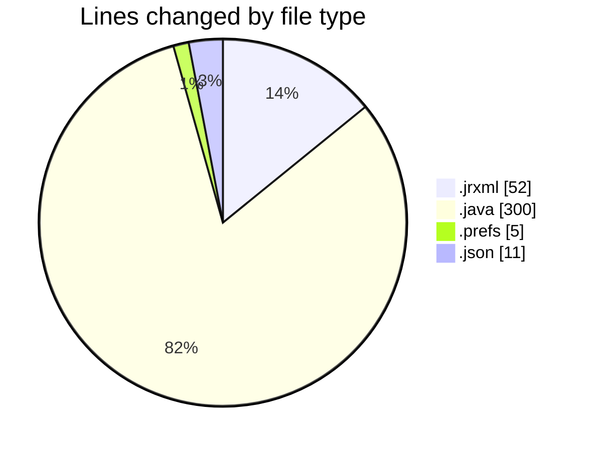
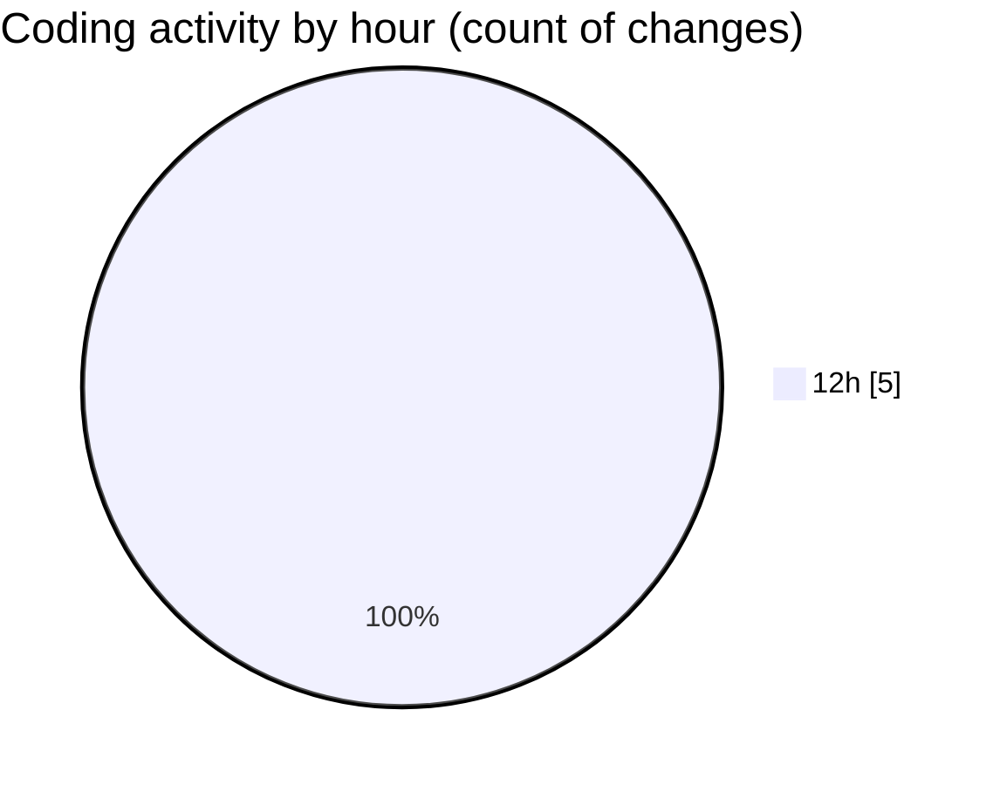

# CILReports (Workspace) - Activity Summary 

## Overall Statistics

| Stat                   | Value                                                             |
| ---------------------- | ----------------------------------------------------------------- |
| **Lines Added** (➕)   | 368                                          |
| **Lines Removed** (➖) | 0                                        |
| **Net Change** (↕)    | 368                |
| **Active Time** (⌚)   | 4 minutes |

## Modified Files
- **SUBREPORTE_CABECERA.jrxml** (+52, -0)
- **JasperAsesoriaServiceImp.java** (+282, -0)
- **ConstantsJasperAsesoria.java** (+18, -0)
- **org.eclipse.m2e.core.prefs** (+5, -0)
- **settings.json** (+11, -0)

## Visualizations

### By File Type (Lines Changed)

### By Hour (Estimated Activity Count)

> **Last Updated:** 9/28/2026, 12:55:33 PM