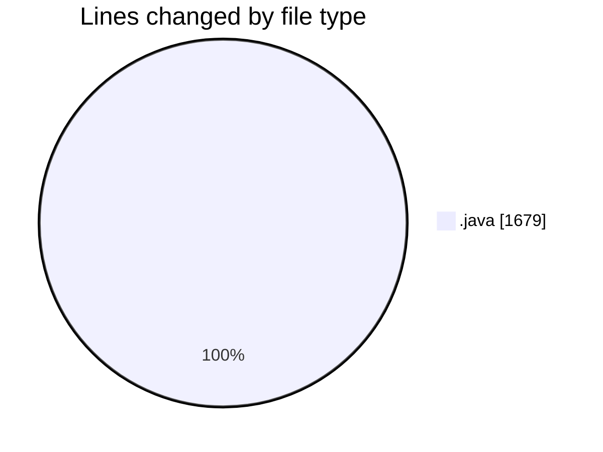
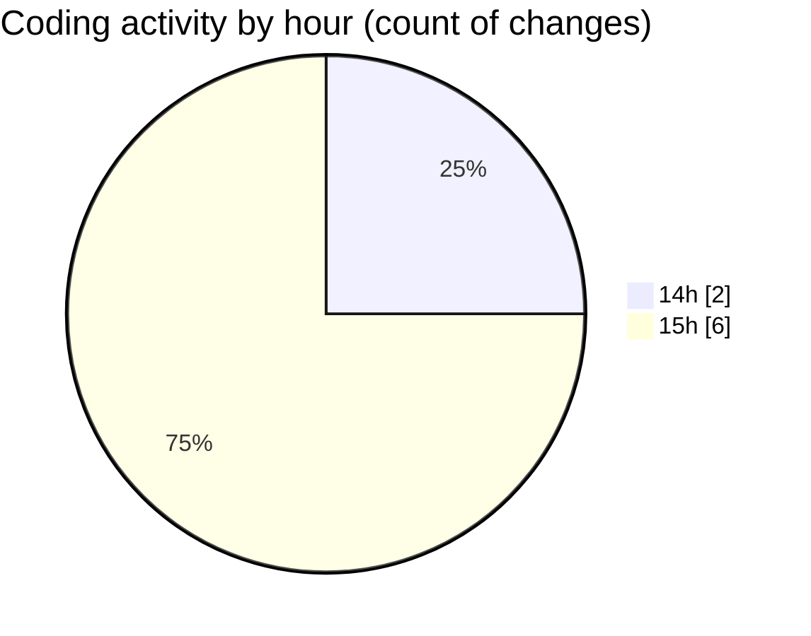

# CILReports (Workspace) - Activity Summary 

## Overall Statistics

| Stat                   | Value                                                             |
| ---------------------- | ----------------------------------------------------------------- |
| **Lines Added** (➕)   | 1674                                          |
| **Lines Removed** (➖) | 5                                        |
| **Net Change** (↕)    | 1669                |
| **Active Time** (⌚)   | 10 minutes |

## Modified Files
- **RecobroRepository.java** (+528, -0)
- **RecobroSqlQueries.java** (+228, -0)
- **JasperRecoverServiceImpl.java** (+918, -5)

## Visualizations

### By File Type (Lines Changed)

### By Hour (Estimated Activity Count)

> **Last Updated:** 9/30/2026, 3:20:59 PM