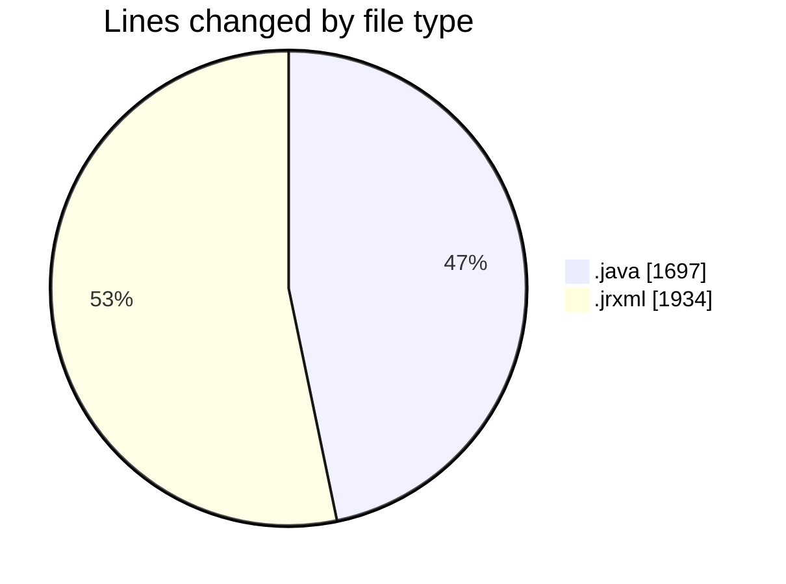
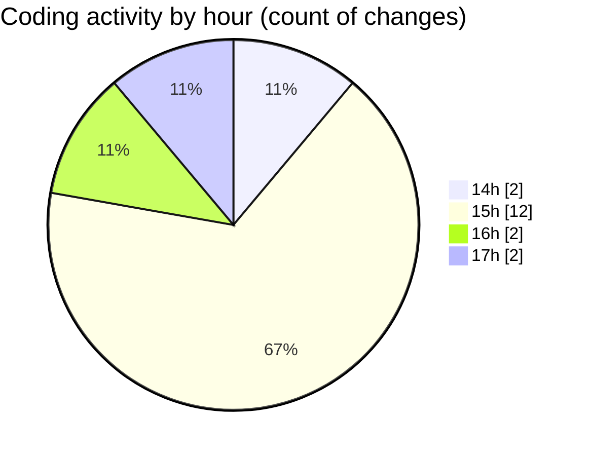

# CILReports (Workspace) - Activity Summary 

## Overall Statistics

| Stat                   | Value                                                             |
| ---------------------- | ----------------------------------------------------------------- |
| **Lines Added** (➕)   | 3622                                          |
| **Lines Removed** (➖) | 9                                        |
| **Net Change** (↕)    | 3613                |
| **Active Time** (⌚)   | 26 minutes |

## Modified Files
- **RecobroRepository.java** (+528, -0)
- **RecobroSqlQueries.java** (+237, -3)
- **JasperRecoverServiceImpl.java** (+923, -6)
- **IF7.jrxml** (+1298, -0)
- **IF7_booklets.jrxml** (+636, -0)

## Visualizations

### By File Type (Lines Changed)

### By Hour (Estimated Activity Count)

> **Last Updated:** 9/30/2026, 5:06:00 PM