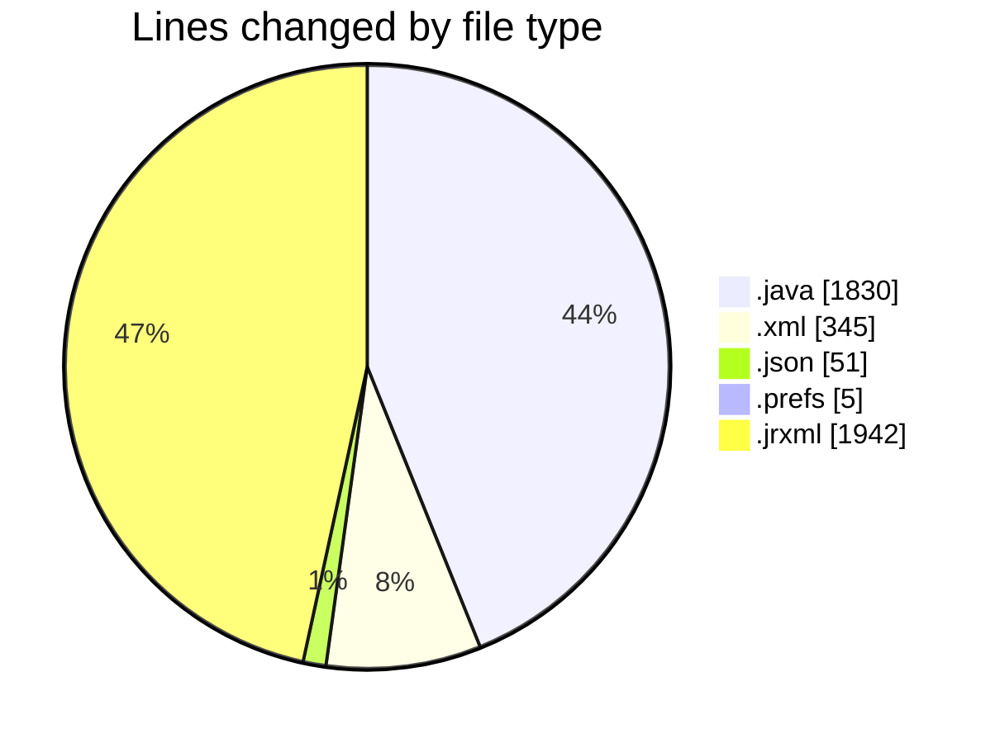
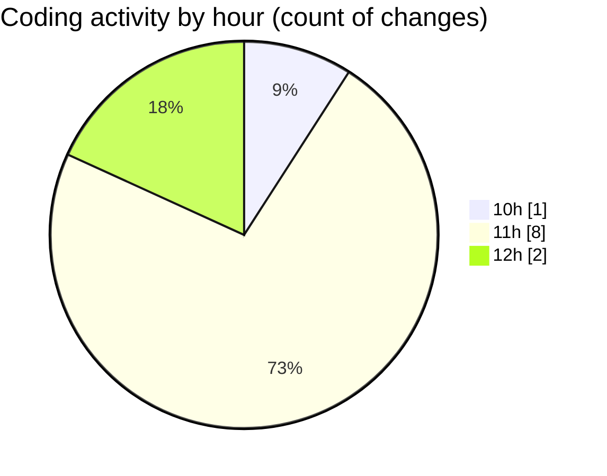

# CILReports (Workspace) - Activity Summary 

## Overall Statistics

| Stat                   | Value                                                             |
| ---------------------- | ----------------------------------------------------------------- |
| **Lines Added** (➕)   | 4151                                          |
| **Lines Removed** (➖) | 22                                        |
| **Net Change** (↕)    | 4129                |
| **Active Time** (⌚)   | 6 minutes |

## Modified Files
- **JasperRecoverServiceImpl.java** (+1830, -0)
- **pom.xml** (+336, -9)
- **launch.json** (+51, -0)
- **org.eclipse.m2e.core.prefs** (+5, -0)
- **IF7.jrxml** (+1296, -13)
- **IF7_booklets.jrxml** (+633, -0)

## Visualizations

### By File Type (Lines Changed)

### By Hour (Estimated Activity Count)

> **Last Updated:** 10/1/2026, 12:08:13 PM