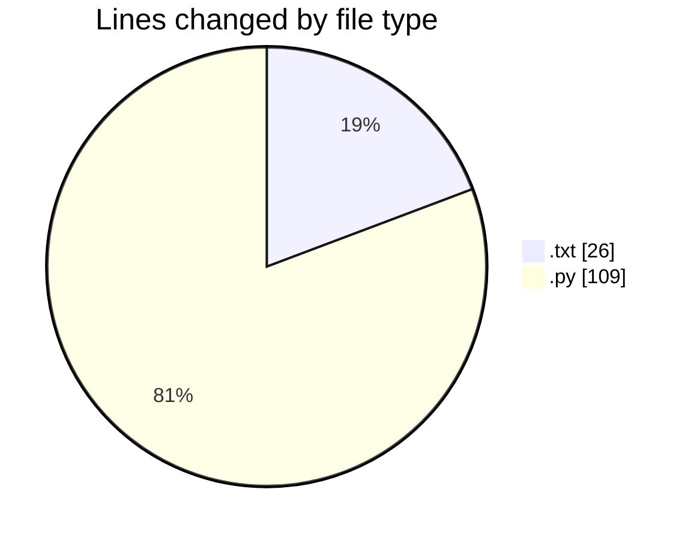
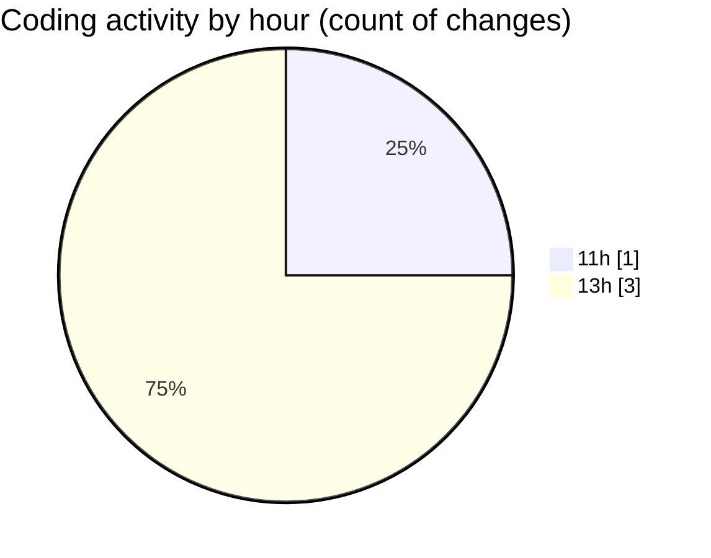

# CILReports (Workspace) - Activity Summary 

## Overall Statistics

| Stat                   | Value                                                             |
| ---------------------- | ----------------------------------------------------------------- |
| **Lines Added** (➕)   | 135                                          |
| **Lines Removed** (➖) | 0                                        |
| **Net Change** (↕)    | 135                |
| **Active Time** (⌚)   | 1 minute |

## Modified Files
- **recupera_factura_FR_2670197610.txt** (+26, -0)
- **cambiar_fecha_pdfs.py** (+109, -0)

## Visualizations

### By File Type (Lines Changed)

### By Hour (Estimated Activity Count)

> **Last Updated:** 10/6/2026, 1:11:32 PM