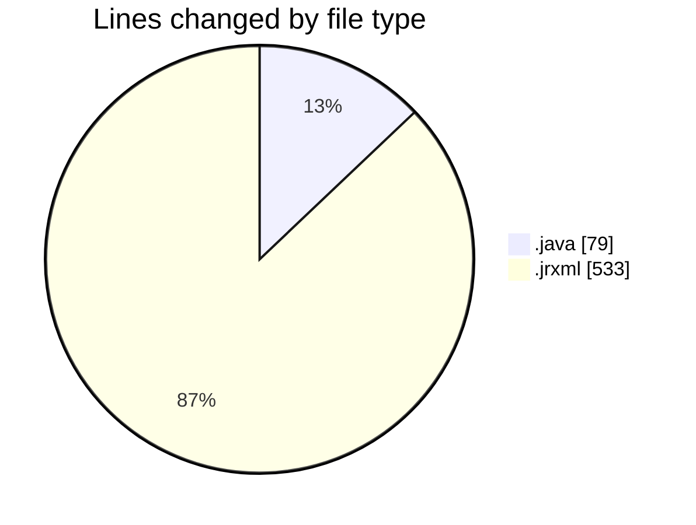
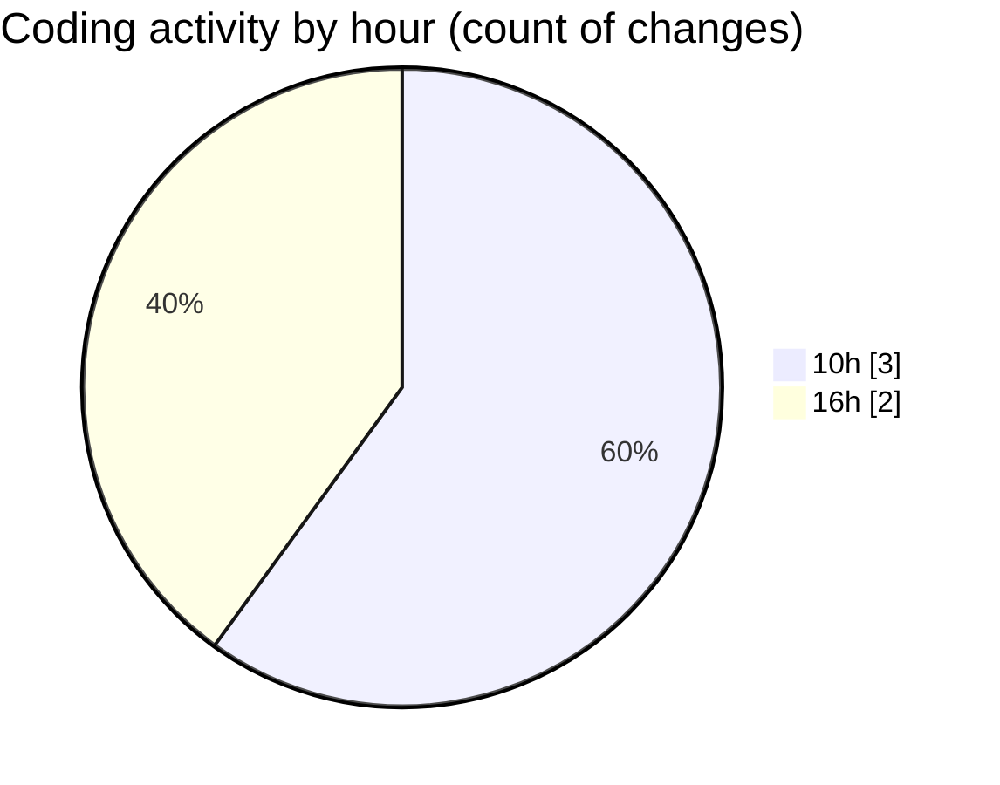

# CILReports (Workspace) - Activity Summary 

## Overall Statistics

| Stat                   | Value                                                             |
| ---------------------- | ----------------------------------------------------------------- |
| **Lines Added** (➕)   | 537                                          |
| **Lines Removed** (➖) | 75                                        |
| **Net Change** (↕)    | 462                |
| **Active Time** (⌚)   | 0 minute |

## Modified Files
- **JasperRecoverServiceImpl.java** (+4, -0)
- **IF7.jrxml** (+8, -0)
- **JasperAsesoriaServiceImp.java** (+0, -75)
- **3650.jrxml** (+525, -0)

## Visualizations

### By File Type (Lines Changed)

### By Hour (Estimated Activity Count)

> **Last Updated:** 10/7/2026, 4:39:48 PM